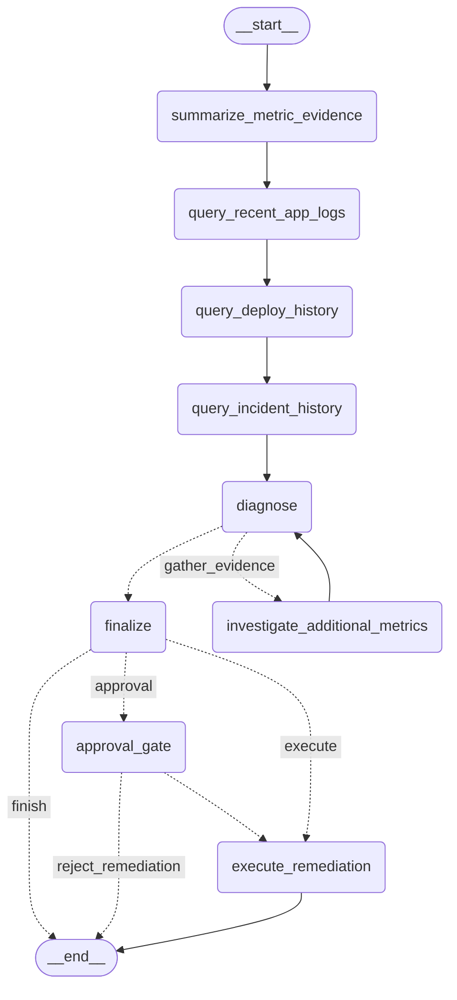

# Methodology

Detailed design and evaluation for each phase of the pipeline. See [README.md](README.md) for the project overview and headline results.

## Why chaos engineering instead of production data or public benchmarks

Root-cause evaluation requires ground truth: what actually caused an incident. Public anomaly-detection benchmarks (e.g. NAB) are well-suited to validating a detection algorithm in isolation, but they carry no causal-topology information and no relationship to this system's own dependency graph, so they cannot validate root-cause attribution or agent reasoning. Production ground truth typically arrives late, if at all, in the form of human-written postmortems.

Self-injected chaos faults sidestep this: the fault type, target, timing, and parameters are known exactly at injection time, giving a complete, labeled dataset for evaluating detection, correlation, and diagnosis end to end. In a real deployment, this system's detection and correlation logic runs unchanged; ground truth for evaluation would instead accumulate from confirmed postmortems over time.

## Phase 2 — Anomaly Detection

Nine metrics are monitored continuously: request rate, application p95 latency, application error rate, Redis average latency, cache error rate, downstream dependency average latency, downstream error rate, process CPU rate, and process resident memory.

Each metric (other than memory) is scored with a modified z-score against a rolling median/MAD reference:

```
score = 0.6745 * |value - rolling_median| / rolling_MAD
```

Window length and alert threshold are tuned per metric — jittery metrics like application latency use a wider window and higher threshold to avoid false alarms on ordinary noise; fast-reacting metrics like error rates use a narrower window and lower threshold. A key implementation detail: the rolling reference is computed from a *lagged* window (excluding the current point), so a point never contaminates the baseline it is scored against — an early implementation that included the current point in its own reference systematically under-detected moderate-magnitude anomalies.

Process memory (and, in earlier iterations, CPU) uses a one-sided CUSUM (cumulative sum) detector instead, scored against a rolling reference rather than a fixed one:

```
s_pos = max(0, s_pos + z - k)   # accumulates only when persistently above normal
```

This is a deliberate choice: a memory leak is a slow, near-monotonic drift, and z-score-style point-anomaly detection is known to be weak at this pattern — it either gets absorbed into a shifting rolling median (missed) or over-fires once baseline variance collapses (false alarm). CUSUM accumulates small persistent deviations over time, which correctly separates transient blips from sustained leaks. Applying CUSUM to CPU as well was tried and reverted after evaluation showed CPU behaves more like a point-anomaly metric in this system; it remains on the standard z-score path.

A persistence filter requires 3 consecutive flagged samples (at a 30-second scrape interval, roughly 90 seconds of sustained deviation) before an alert counts, to suppress single-sample noise. This is a real precision/recall tradeoff, not a free win: it means faults shorter than the persistence window (see the `memory_spike` case below) are correctly *not* flagged — a deliberate design tradeoff, not a miss.

**Baseline false-alarm rate:** ~9-10% on a timeline basis (fraction of 30-second windows with any false alarm across all nine metrics combined). A per-metric breakdown showed this is concentrated in a small number of metrics rather than evenly spread — process memory alone accounted for the majority of false alarms before the CUSUM fix.

## Phase 3 — Root-Cause Correlation

Given a set of metrics that fired anomalies in the same incident window, Phase 3 ranks which one most likely caused the others.

**Dependency prior:** a hand-encoded table of which metrics can plausibly cause which others, based on this system's actual architecture (e.g. Redis latency can cause application latency and errors; application latency cannot cause Redis latency). This prevents pure correlation from confusing symptom for cause.

**Lag cross-correlation:** for each pair of co-firing metrics, cross-correlation is computed across a small lag window (±4 steps, ±2 minutes at 30-second resolution) to find the best-aligned lag and its correlation strength. For metrics on the CUSUM path (memory), the *first difference* (rate of change) is correlated rather than the raw value — a monotonic ramp and a spiky symptom metric do not shape-match well in raw form even when one causes the other, so differencing gives a fairer basis for comparison.

**Combined score:** `confidence = 0.5 * prior_score + 0.35 * correlation_score + 0.15 * onset_timing`, where `prior_score` is the fraction of co-firing metrics a candidate could plausibly explain per the dependency table, and `onset_timing` rewards earlier onset relative to other events in the window. A peak-score-magnitude term was tried (to let an extreme CUSUM score outweigh a modest z-score) and reverted after evaluation showed it compared incompatible units — CUSUM's cumulative score and a bounded z-score are not on the same scale, and the term caused memory to dominate rankings for unrelated fault types.

Special cases: incidents with only one flagged metric skip ranking entirely (the sole event is the answer); a hard-outage signal (application availability) always wins outright, since a full outage has no meaningful "root cause" ranking to compute.

| Method | Accuracy* |
|---|---|
| Naive (earliest-triggered metric) | 27% |
| Dependency prior + lag correlation + onset timing | 70% |

## Phase 4 — LLM-Augmented Diagnosis

A LangGraph state machine takes Phase 3's ranked candidates and evidence, gathers additional context, and produces a final diagnosis and remediation recommendation.

Full LangGraph state graph:



**Evidence-gathering nodes**, run for every incident: quantitative metric analysis (min/max/mean/trend around the candidate's onset window, pulled from Prometheus), application log samples from the incident window, recent deploy history, and similarity against past incidents in the chaos log. A metric-behavior/role analysis node separately classifies each candidate metric as an upstream resource, a dependency metric, or a downstream symptom, giving the LLM semantic context beyond raw statistics.

**Escalation:** if confidence remains below threshold after the standard evidence nodes, the agent expands investigation to metrics topologically related to the top 3 candidates (via the same dependency prior from Phase 3), rather than querying every unused metric — a deliberate cost/thoroughness tradeoff so the agent only reaches for broader telemetry when cheaper evidence hasn't resolved the case.

**Diagnosis (Amazon Bedrock, Nova Pro, temperature 0):** the LLM is instructed to treat the Phase 3 top candidate as the default diagnosis, and to override it only when evidence — correlation strength, metric-role classification, or temporal ordering — meaningfully contradicts it. It is explicitly told not to invent causes absent from the evidence, and not to assume causation from correlation or onset order alone. Confidence is computed as `min(phase3_confidence + 0.15, llm_confidence)`, so the LLM's own stated confidence cannot inflate a diagnosis beyond what the statistical evidence supports.

A structural confound was found and mitigated during evaluation: process memory's resident-set size ramps up rapidly during process startup, independent of any real fault, which caused a naive onset-timing signal to systematically (and wrongly) flag memory as the earliest, and therefore most causal, deviation in almost every incident. The prompt explicitly discounts onset timing for this metric in favor of its correlation and behavior classification.

**Remediation:** the LLM selects from a fixed action set (`restart_service`, `scale_out`, `flush_cache`, `rollback_deploy`, `none`), with explicit prompt-level guardrails — for example, Redis or downstream latency alone must never justify a restart; a restart requires availability failure, crash evidence, or explicit unhealthy-service signals. Low-risk actions execute automatically in a dry run; high-risk actions require human approval via a LangGraph interrupt before execution.

| Layer | Accuracy* |
|---|---|
| Statistical pipeline alone (Phase 3) | 70% |
| Statistical pipeline + LangGraph LLM reasoning | 80% |

Ground-truth accuracy has held stable at 80% across repeated evaluation runs. Some run-to-run variance is observed in *which* specific incidents the LLM agrees with Phase 3 versus overrides (agreement has ranged 80-90%, with 1-2 overrides per run) — `temperature=0` on Bedrock reduces but does not fully eliminate non-determinism, and evidence-gathering nodes pulling live Prometheus data can return slightly different windows between runs. The final accuracy figure has not moved.

*\*Sample-size caveat: these figures are computed over 10-11 self-injected incidents — small enough that each individual incident shifts the reported accuracy by roughly 10 percentage points. The comparative direction (naive → statistical correlation → LLM-augmented) is the meaningful signal here; the absolute percentages should be read as indicative on this dataset, not as statistically precise estimates of real-world performance. A larger labeled incident set would be needed to tighten these numbers.*

### Case study — correct override (`downstream_latency_fdc80266`)

The statistical pipeline ranked `process_resident_memory_bytes` as the top candidate (confidence 0.609) over the true root cause, `downstream_average_latency_seconds` (confidence 0.486), because memory's CUSUM score reflected the earliest onset in the window. Across evaluation runs, the LLM agent has consistently identified this as a red herring — memory's correlation with the observed symptoms (~0.36-0.60) was substantially weaker than the downstream metric's (~0.98) — and overridden the ranking to the correct answer. This is the one override that has recurred identically across every run; the LLM occasionally makes a second override elsewhere (see reproducibility note above), which has not consistently corrected or worsened the final accuracy.

### Known limitation (`cpu_spike_52dcb84f`)

Consistently misdiagnosed by both the statistical pipeline and the LLM layer. Three candidates (CPU, Redis latency, downstream latency) have closely spaced confidence scores and similar correlation strength in this specific incident, making it a genuinely ambiguous case rather than an implementation defect.

### Remediation safety verification

All remediation guardrails held across evaluation: no unsafe action recommended for latency-only evidence, no restart recommended without availability or crash evidence, every action correctly gated for approval when high-risk. Verified against live infrastructure in a non-dry-run run (real container restart executed and confirmed).

## Path to Production

The evaluation above uses self-injected faults on a self-hosted app specifically because it gives complete, exact ground truth — but several parts of the system would need to change to operate against a real production environment and real, unlabeled incidents.

**Detection (Phase 2).** The MAD/CUSUM detectors here are tuned against a flat synthetic baseline with no daily or weekly traffic pattern. Real traffic has strong diurnal and weekly seasonality (e.g. request rate at 3am vs. peak hours), so a production version would need seasonal-aware baselines rather than a flat rolling reference. This wouldn't require building a new model from scratch — options range from lightweight (STL (Seasonal/Trend/Residual) decomposition, scoring anomalies against the residual instead of the raw value) to managed services like AWS CloudWatch's built-in anomaly detection bands, which bootstrap a seasonal model per metric automatically and would fit directly into this system's existing AWS deployment.

**Correlation (Phase 3).** The dependency-topology prior is currently a hand-encoded table specific to this system's small, fixed architecture. In a real, evolving microservices environment this would go stale quickly as services are added, removed, or re-wired. A production version would need to derive this topology from something that stays current automatically — service mesh configuration, distributed tracing data (e.g. span parent-child relationships), or a service catalog — rather than a manually maintained table.

**Evidence nodes (Phase 4).** Deploy-history and incident-history evidence currently come from a synthetic, self-logged chaos log. In production these would connect to real systems: deploy history from CI/CD (e.g. GitHub Actions or ArgoCD deploy events), and incident similarity from an actual incident-management system (PagerDuty, Opsgenie, or an internal postmortem database) rather than a hand-maintained log the agent already knows the answers to.

**Evaluation and ground truth.** Chaos-injected faults give exact, immediate ground truth; production incidents don't. Real ground truth would instead accumulate slowly from confirmed human postmortems, often written after the fact and sometimes ambiguous even to the humans involved. This means the accuracy figures reported here should be read as a best-case ceiling under clean, fully-labeled conditions — a production deployment would need an ongoing feedback loop (comparing agent diagnoses against eventual postmortem conclusions) to track whether real-world accuracy holds, degrades, or needs retuning as the system encounters incident types not represented in this evaluation set.

**Remediation.** The current fixed, global action set (`restart_service`, `scale_out`, `flush_cache`, `rollback_deploy`, `none`) with a single approval gate is reasonable for one service. A production rollout across many services/teams would likely need per-service or per-team remediation policies, tighter blast-radius controls (e.g. a restart on a subset of instances before a full rollout), and an audit trail tying every automated or approved action back to the diagnosis and evidence that justified it.