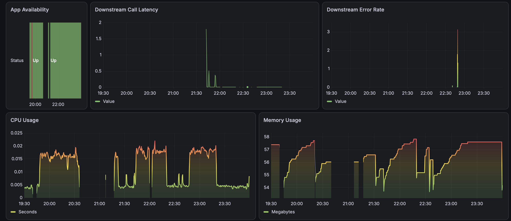
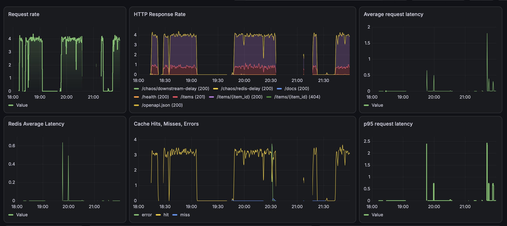
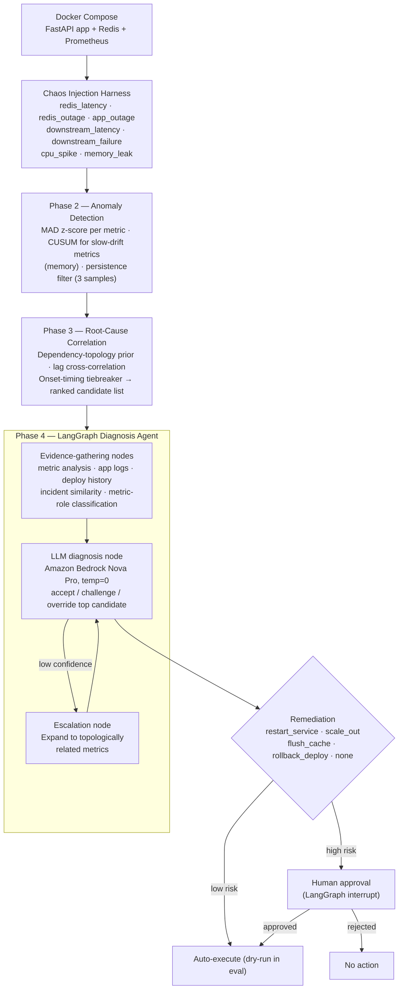

# Agentic AIOps Self-Healing System

A chaos-engineered incident response pipeline that detects anomalies in a live service, statistically ranks likely root causes, uses an LLM-driven LangGraph agent to reason over evidence and confirm or override the statistical diagnosis, and executes gated remediation.

Most AIOps demos stop at anomaly detection. This project goes further: given a detected anomaly, it identifies the most probable root cause using a deterministic statistical pipeline, hands that ranked hypothesis to an LLM agent for evidence-grounded reasoning, and only then decides on and executes a remediation action — with human approval required for any high-risk operation.

The system is deliberately layered so the hard quantitative work (detection and correlation) is handled by evaluated, explainable statistics, while the LLM's role is narrower: explain, challenge when evidence warrants it, and recommend action from a fixed, guarded action set. The LLM never invents a root cause from raw telemetry — it reasons over a hypothesis a tested pipeline already produced.

## Results at a glance

| Stage | Root-cause accuracy* |
|---|---|
| Naive (earliest-triggered metric) | 27% |
| Statistical pipeline (dependency prior + lag correlation + onset timing) | 70% |
| Statistical pipeline + LangGraph LLM reasoning | **80%** |

- Evaluated end-to-end on **10 self-injected chaos incidents** across 7 fault types (Redis latency/outage, app outage, downstream latency/failure, CPU spike, memory leak) — full ground truth known at injection time.
- The LLM layer correctly overrode a statistically-favored but wrong candidate in a recurring case (`downstream_latency_fdc80266`) by weighing correlation strength over a misleading onset signal — see the [case study](METHODOLOGY.md#case-study--correct-override-downstream_latency_fdc80266).
- All remediation guardrails held: no unsafe action ever recommended on latency-only evidence, no restart without availability/crash evidence, every high-risk action correctly gated for human approval.
- **One known, understood limitation**: a genuinely ambiguous incident (`cpu_spike`) with three closely-matched candidates is misdiagnosed by both layers — documented, not hidden.

*Sample-size caveat: 10-11 incidents means each one shifts reported accuracy by ~10 points. The comparative direction (naive → statistical → LLM-augmented) is the meaningful signal; treat the absolute percentages as indicative on this dataset, not precise real-world estimates. Full discussion in [METHODOLOGY.md](METHODOLOGY.md).*

## Demo

**Dashboard** — Grafana panel showing request latency, error rate, and Redis latency visibly responding during a live chaos fault injection. Shows the monitored system is a real running service with real telemetry, not synthetic data generated after the fact.




**Live remediation** — a non-dry-run pass of the full pipeline against live infrastructure: fault injection → detection → diagnosis → human approval prompt → actual `docker compose restart` executed and confirmed.


https://github.com/user-attachments/assets/4cfea308-10b8-42ea-9e40-c5ee535436eb


## Architecture



For the detailed methodology behind each phase — detection formulas, correlation math, evidence-gathering design, and the full case studies — see **[METHODOLOGY.md](METHODOLOGY.md)**.

## Components

- **Chaos harness** (`chaos/`) — Docker-based fault injectors for 7 fault types, each logging ground-truth timing and parameters to `chaos/incidents.log`.
- **Detectors** (`detector/mad_detector.py`, `detector/forecast_detector.py`) — per-metric anomaly detection with a CUSUM path for slow-drift metrics.
- **Root-cause pipeline** (`detector/rootcause/`) — event extraction, dependency-topology prior, lag correlation, ranking.
- **Diagnosis agent** (`agent/`) — LangGraph state machine: evidence-gathering nodes, escalation logic, LLM diagnosis node, remediation finalization and execution, human-approval interrupt.
- **Evaluation harnesses** — `detector/evaluate.py` (detection), `detector/evaluate_rootcause.py` (correlation), `agent/evaluate_diagnosis.py` (full agent, end to end).

## Tech Stack

Python, FastAPI, Redis, Prometheus, Docker Compose, LangGraph, Amazon Bedrock (Nova Pro), pandas, numpy.

## Running It

```bash
docker compose up -d
python3 -m chaos.run_experiment --fault redis_latency
python3 -m detector.evaluate.py
python3 -m detector.evaluate_rootcause.py
python3 -m agent.evaluate_diagnosis
```

Set `DRY_RUN = False` in `agent/remediation.py` to execute remediation actions against live infrastructure rather than simulating them.

> NOTE: `auto_approve` in `agent/evaluate_diagnosis.py` is currently `True`, so evaluation runs auto-approve every remediation action rather than pausing for human input. Set it to `False` to exercise the approval-gate interrupt manually.

## Known Limitations

- Root-cause ranking for faults producing closely-matched candidate signatures (see the `cpu_spike` case study in [METHODOLOGY.md](METHODOLOGY.md)) remains unresolved by both the statistical and LLM layers.
- Deploy-history and incident-history evidence nodes are validated against synthetic/self-logged data; a production deployment would integrate real CI/CD and incident-management systems.
- Ground-truth accuracy figures are measured against 10-11 self-injected incidents; a larger labeled set would tighten confidence in these numbers.
